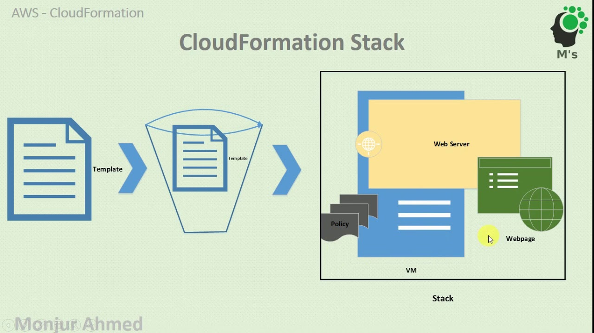

**Quota**: There is a certain limit in creating the resources according to the resource category
* we can raise a quote request when the resources limit is exceeded

**Idempotency**: The resource should be created by the code,if there is no resource exist in that category already.otherwise it shouldn't create the resource is known as idempotency in nature
* The commands that we use in shell scripts and pipeline to create the resources are not idempotent in nature
  Ex: aws ec2 create-vpc, aws ec2 run-instances etc....
* To get the idempotency while creating the resources.we can use the Iac tools like Terraform,cloudFormation,CDK etc...


### cloud Formation

cloud Formation is a Iac service in AWS
* it is idempotent in nature
* it a regional service
* Ex end point: cloudformation.us-east-1.amazonaws.com

cloud formation API actions Reference will be in below documentation
```
https://docs.aws.amazon.com/AWSCloudFormation/latest/APIReference/API_Operations.html
```
Overview working of cloudformation:
**Template:** It is a text file written in either json or yaml format.it contains the required infrastructure resources that we want to create
**stack:** It is a group of resources

**Overview of stack Creation:**


Template -----> CreateStack(API action) -----> Stack

* By using the CreateStack API action,We will request the cloudFormation service to create a stack for our template

The following example shows the structure of a YAML-formatted template with all available sections:

AWSTemplateFormatVersion: "version date"

Description:
  String

Metadata:
  template metadata

Parameters:
  set of parameters

Rules:
  set of rules

Mappings:
  set of mappings

Conditions:
  set of conditions

Transform:
  set of transforms

Resources:
  set of resources

Outputs:
  set of outputs


### *From the above CFT format.The main necessary sections are*

**AWSTemplateFormatVersion: "version date"**

**Description:**

**Resources:**